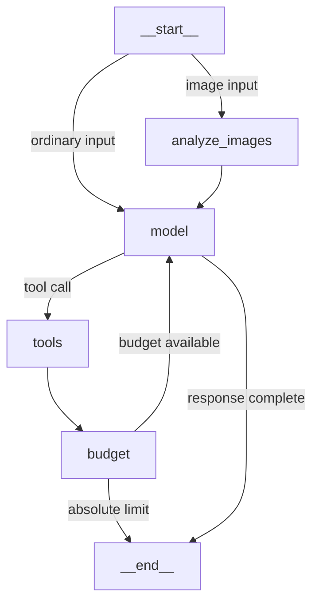

# Assistant Graph Topology

This Graph Topology documents every route the Assistant may take. It is not an
Execution Path taken by a particular Turn. Phoenix retains that Execution Path
inside the fuller Execution Trace, which also includes model and Tool evidence.

The displayed names are exact runtime identities. `__start__` and `__end__` are
LangGraph boundaries; the formal Assistant nodes are `model`,
`tools`, `analyze_images`, and `budget`.

## Tool inventory

This is the deterministic, generation-time Tool registry used to construct the
graph. Runtime configuration may make Tool availability differ by environment.

- `execute_command`
- `load_skill`
- `read_skill_resource`
- `recall_memory`
- `save_memory`
- `web_search`

## Recursion budget

The `budget` node pauses for a user decision after 20 and 40 Tool steps and ends
the Turn at the absolute limit of 60 Tool steps. These are node behaviors, not
additional graph nodes or edges.

Regenerate locally with `uv run python graph_topology.py`. Mermaid source remains local; this
workflow does not use Mermaid.ink or any hosted renderer.
